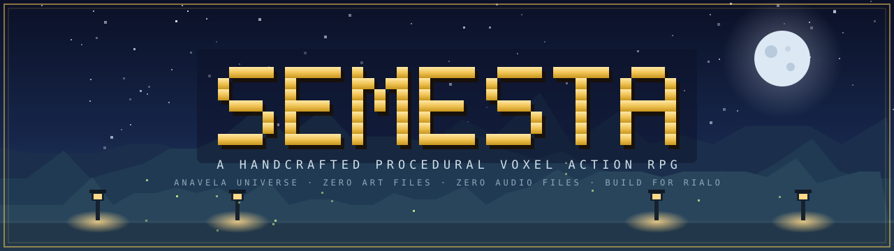
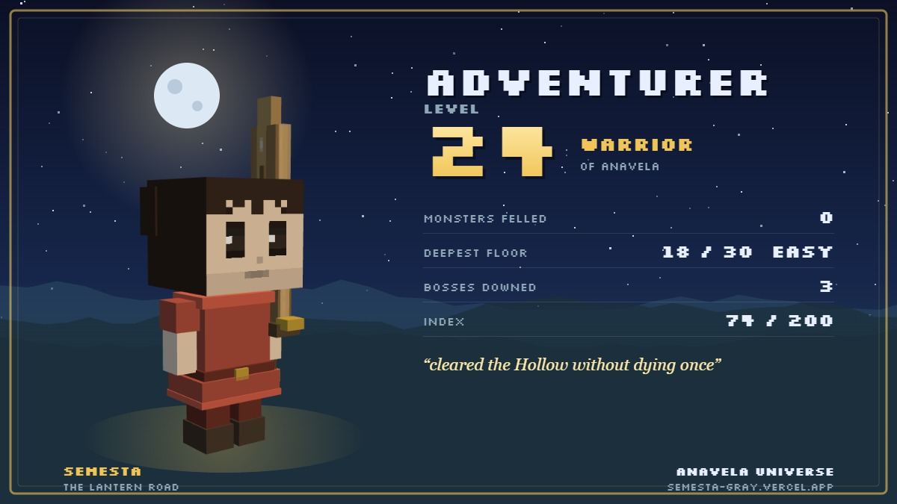
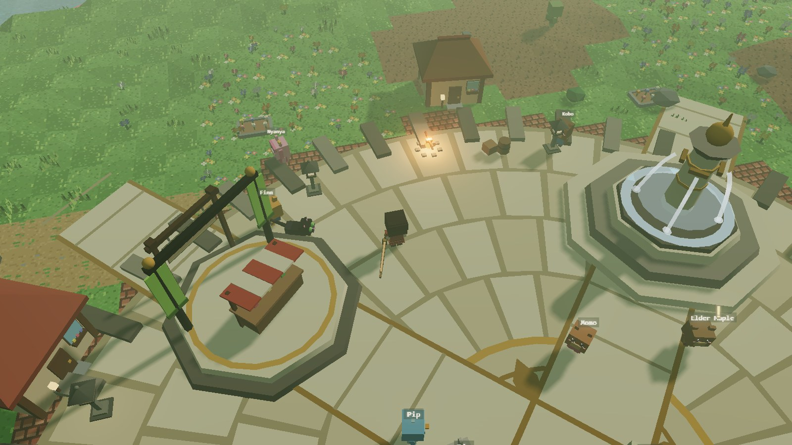
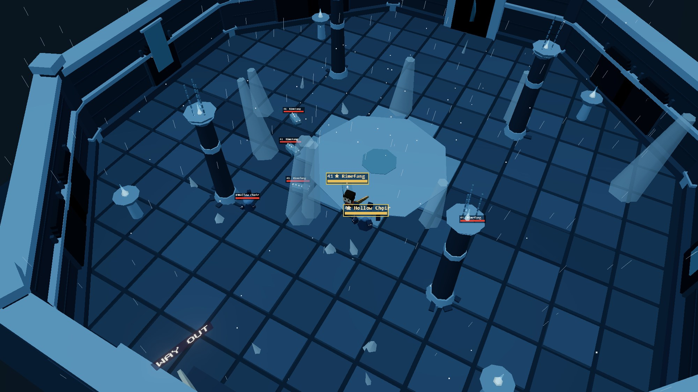
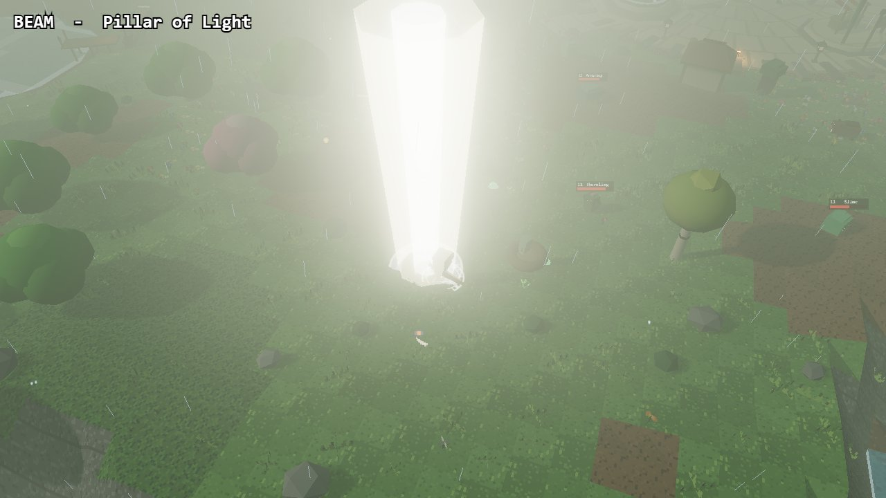
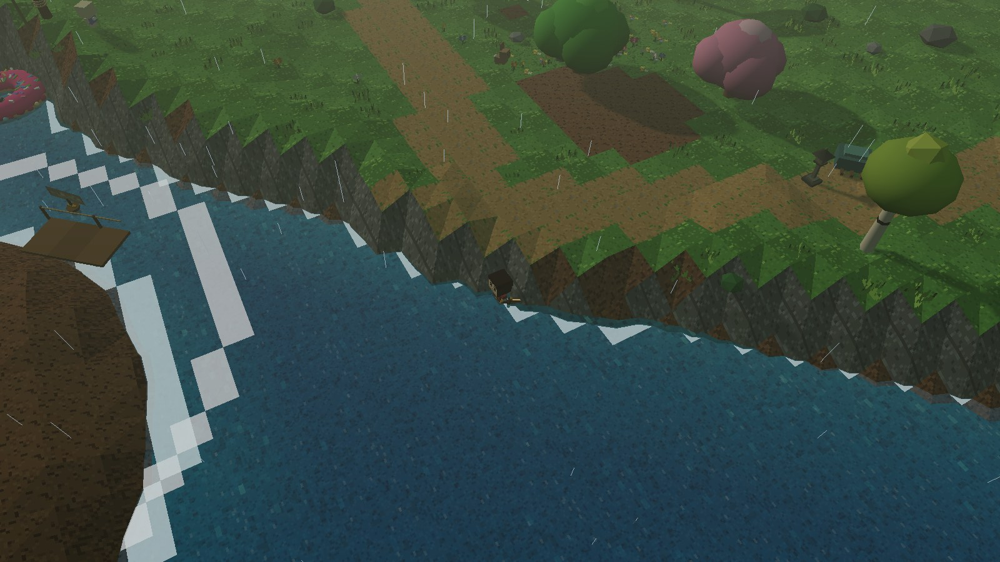

<div align="center">



<br>

**English** · [Bahasa Indonesia](README.id.md) · [中文](README.zh.md)

<br>

[](https://semesta-gray.vercel.app/)
[](https://threejs.org)
[](https://rialo.io)

*An open-world voxel action RPG that runs in your browser.
Every texture is painted at runtime. Every note of music is synthesized live.
There is not a single image or audio file in the game.*

</div>

---

## What is Semesta?

**Semesta** (Indonesian for *"the universe"*) is a cozy 2.5D voxel action RPG set in the
world of **Anavela** — a lantern-lit land of pine forests, snowfields, and a nine-island
archipelago, where you play the last apprentice of the Lanternkeepers and relight a world
that went dark.

It is also a technical statement: the entire game — terrain, characters, monsters,
weapons, UI icons, music, and sound effects — is **generated procedurally in code**.
The repository ships zero art assets and zero audio files (the only exceptions are two
branding logos). A 16-pixel canvas and the WebAudio API do everything.

<div align="center">

<br><sub><i>The <b>Chronicle Card</b> — press <code>P</code> to render your own hero in 3D, pick a design, and post it.</i></sub>
<br><br>




</div>

---

## Features — all shipped, all playable today

| System | What's inside |
|---|---|
| ⚔ **Classes** | Begin as an **Origin** with nothing but a borrowed sword; at Lv 10, awaken into one of **7 classes** — Warrior (sword *or* axe), Archer, Mage, Priest, Assassin, Summoner (cannon + minions), Fighter (bare-handed 3-hit combos). Per-class skill trees, 48 skills. |
| 🏰 **The Hollow** | A 30-floor endgame dungeon × 3 difficulties. Three themed bands (Stone Halls / Frost Crypt / Ember Core), **6 exclusive monster species and 6 bosses** with telegraphed multi-phase mechanics, 21 limited-edition drops. Every cleared floor is replayable. |
| 🎫 **Seasonal GamePass** | A **50-tier season pass** on a 30-day calendar that every client agrees on without a server. Four rotating seasons with genuinely different reward tracks, endless prestige caches past tier 50, and the **Keeper's Vault** — a spin that *never* gives duplicates. |
| 🎰 **Wonder Capsules** | Six-tier gacha with soft pity, a painted capsule machine, 10× pulls, and a full odds/prize browser before you spend a coin. Class-aware: a pull never gives you a weapon you can't hold. |
| 🌍 **Open world** | A 200-cell deterministic world: winter biome, ocean covering ~a third of the map, **9 hand-placed islands**, swimming & diving, two pilotable watercraft, wildlife that reacts to you, weather, and a full day/night cycle. |
| 🐾 **Collection** | **203 items · 57 weapons · 60 cosmetics · 17 pets · 8 mounts** — every pet physically fetches your loot. **The Index** logs all 200 discoverable entries with silhouette hints for what you haven't found. |
| 🏡 **Homestead** | One buildable island estate with a 3-tier ladder (cabin → cottage → villa). Construction takes real wall-clock time — the site scaffolds up while you're away. |
| 🌾 **Life skills** | Fishing, farming, and cooking each have their own XP and skill trees. Mythic fish exist — and exactly one node in the game unlocks them. |
| 👥 **Multiplayer** | An authoritative server owns the clock, weather, spawns and world bosses. Google sign-in, **3 character slots**, cloud saves with a merge that never deletes a hero. World chat, friends, other players rendered with their real gear. |
| 🎵 **Generative audio** | **10 procedurally-composed music tracks** across 4 moods that rotate every 16 bars, plus ~60 synthesized sound effects. No audio files. |
| 📱 **Any device** | Full touch controls with pinch-zoom, non-overlapping button layout, and graphics presets from LOW to ULTRA with adaptive resolution. |

---

## The tech, briefly

- **Renderer** — [three.js](https://threejs.org) with ACES filmic tone mapping, UnrealBloom,
  optional N8AO ambient occlusion, adaptive render-scale that follows a measured frame
  budget, and a light culler that keeps the visible-light count constant (a changed count
  recompiles every shader in the scene — this was the stutter fix).
- **Art** — every texture, sprite, and icon is painted onto a 16 px canvas at load.
  Cosmetics, weapons, monsters and buildings are built from primitive meshes through a
  shared geometry/material cache, then statically baked per structure (village props:
  401 → 67 draw calls).
- **World** — deterministic from fixed seeds. The multiplayer server never sends the map;
  every client generates a byte-identical world, so the wire carries only entities.
- **Audio** — chord progressions, melodies, and every SFX are synthesized in WebAudio.

```bash
npm install
npm run dev      # http://localhost:5173
npm run build    # production build
```

Multiplayer is optional: point `VITE_GAME_SERVER` at a deployed [`server/`](server/)
instance (see [MULTIPLAYER.md](MULTIPLAYER.md)) and a **🌐 PLAY ONLINE** door appears
in the menu. Without it, the game is fully playable solo.

---

## Controls

| Input | Action | | Input | Action |
|---|---|---|---|---|
| `WASD` / joystick | Move | | `N` | World map + waypoints |
| `LMB` / ⚔ | Attack (auto-aim) | | `O` | Wardrobe & appearance |
| `RMB` / `Shift` | Dodge roll / dive | | `M` | Mount |
| `Space` | Jump | | `B` | Auto-battle |
| `1–3` | Skills · `4` Tonic | | `G` | AFK fishing |
| `F` / `R` | Interact (primary / secondary) | | `J` / `U` | Daily rewards / GamePass |
| `T` / `Y` | Teleport home / basecamp | | `K` / `L` / `Z` / `X` | Skills / Life skills / Stats / Index |

---

## Built for Rialo

Semesta is being prepared for [**Rialo**](https://rialo.io), whose testnet is
[live now](https://playground.rialo.io). The fit is architectural, not cosmetic: the
game already runs season clocks, build timers and world-boss schedules — exactly the
asynchronous workloads Rialo executes natively as reactive transactions. The full
on-chain design (asset classes, economy firewall, four-release sequencing) lives in
[docs/Semesta-Chronicle.pdf](docs/Semesta-Chronicle.pdf).

**Roadmap** — ① Token launchpad → ② Holder access tier → ③ Token gacha alongside gold → ④ Genesis NFT free-mint for active players.

---

## The team

| | Role | |
|---|---|---|
| **Nxrskyaa** | Game Developer | [x.com/nxrskyaa](https://x.com/nxrskyaa) |
| **Dikzzy** | Game Tester & Bug Hunter | [x.com/diikzzyy__](https://x.com/diikzzyy__) |
| **Baster** | Technical Game Developer | [x.com/Bas_Basterx](https://x.com/Bas_Basterx) |

<div align="center">
<br>

**[▶ Play Semesta now](https://semesta-gray.vercel.app/)** — no install, no wallet, no download. Just a browser.

<sub>◆ BUILD FOR RIALO ◆</sub>

</div>
